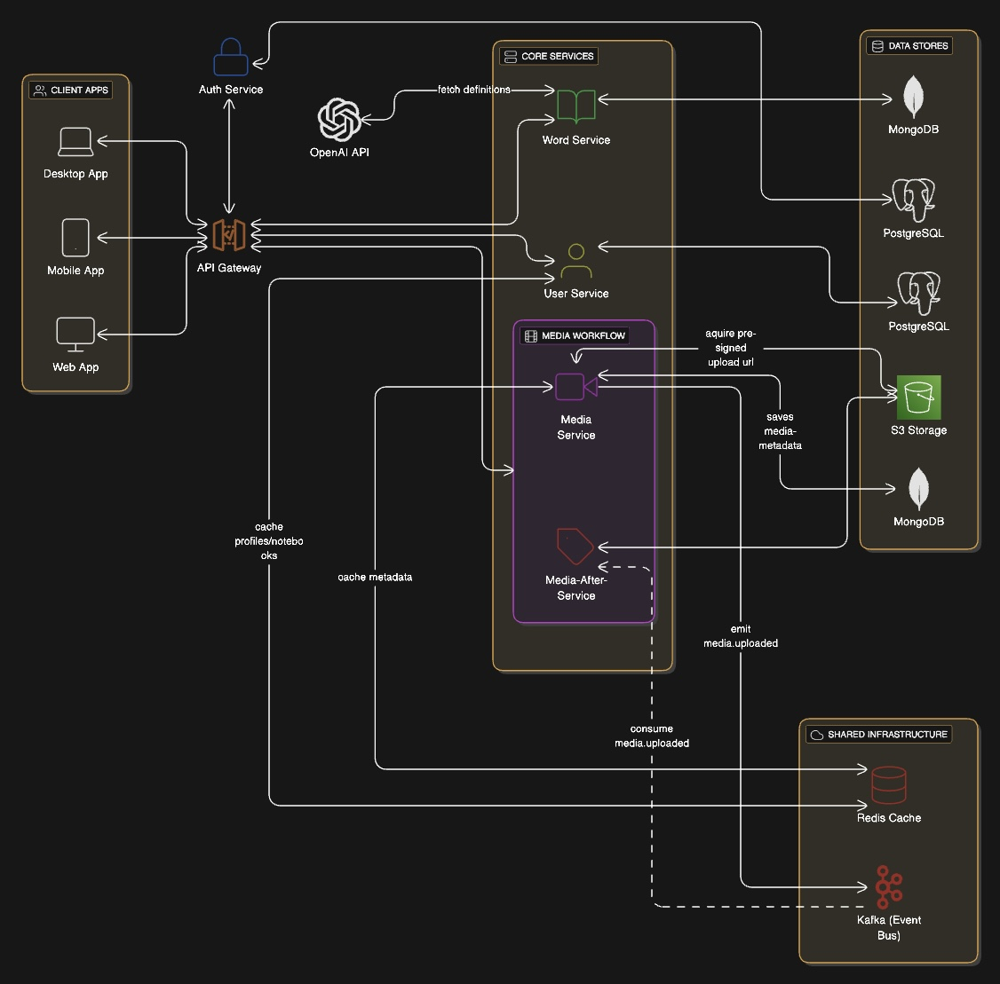

# 📚 Multimedia Dictionary Application


A reactive Spring Boot microservices application consisting of:

- **Word Service**: Manages dictionary entries with AI-powered definitions
- **Auth Service**: Handles user authentication and authorization (migrate to keycloak later)
- **User Service**: Handles user profile management and user vocabulary notebook management
- **Media Service**: Handles acquiring pre-signed media upload url from S3 and saving media-metadata
- **Media-After-Service**: Handles media format transformation, compression, etc. and media is uploaded to S3 from frontend
- **API GATEWAY**: Handles auth verification (with auth service or keycloak) and authorization-based traffic routing


---

### 🐳 Docker Compose
Make sure environment variables in the docker compose file are provided: OPENAI_API_KEY, JWT_SECRET
```bash
docker compose up --build
```

---

## 🔐 Auth Endpoints (`/api/auth`)

### `POST /register` — Register a new user

**Request Example:**
```json
{
  "email": "user@example.com",
  "password": "securePassword123",
  "authProvider": "REGISTRATION"
}
```

**Response Example:**
```json
{
  "publicId": "abc123",
  "email": "user@example.com",
  "role": "USER",
  "createdAt": "2025-07-01T12:00:00Z"
}
```

---

### `POST /login` — Login and receive JWT

**Request Example:**
```json
{
  "email": "user@example.com",
  "password": "securePassword123"
}
```

**Response Example:**
```json
{
  "publicId": "abc123",
  "email": "user@example.com",
  "role": "USER",
  "token": "jwt.token.here"
}
```

---

### `POST /get-member` — Upgrade USER to MEMBER

**Request Example:**
```json
{
  "upgradeCode": "VIP123"
}
```

**Response Example:**
```json
{
  "publicId": "abc123",
  "email": "user@example.com",
  "role": "MEMBER",
  "token": "new.jwt.token"
}
```

---

### `GET /profile` — Confirm user is authenticated

**Response Example:**
```json
"User is authenticated"
```

---

### `GET /user` — Check access as a USER role

**Response Example:**
```json
"Access granted: USER"
```

---

### `GET /member` — Check access as a MEMBER role

**Response Example:**
```json
"Access granted: MEMBER"
```

---

## 📘 Dictionary Endpoints (`/api/words`)

### `GET /{word}` — Get detailed dictionary entry for a word

**Response Example:**
```json
{
  "id": "1",
  "word": "hello",
  "dictionaryInfoList": [
    {
      "partOfSpeech": "interjection",
      "pronunciation": {
        "uk": "həˈləʊ",
        "us": "həˈloʊ"
      },
      "wordSenseList": [
        {
          "definitionEn": "A greeting",
          "translationZh": "你好",
          "sampleExpressions": ["Hello there!"],
          "sampleSentences": ["She said hello as she walked in."]
        }
      ]
    }
  ]
}
```

---

## 👤 User Profile and Notes (`/api/user`)

---
### Profile (`/profile`)
#### `GET` — Get user profile

**Response Example:**
```json
{
  "profileName": "JohnDoe",
  "bio": "Language enthusiast",
  "profileImageUrl": "http://example.com/image.png",
  "gender": "MALE",
  "dateCreated": "2025-07-01T12:00:00Z",
  "dateUpdated": "2025-07-01T12:00:00Z"
}
```

#### `POST` — Create profile

**Response Example:**
```json
{
  "profileName": "JohnDoe",
  "bio": "Language enthusiast",
  "profileImageUrl": "http://example.com/image.png",
  "gender": "MALE",
  "dateCreated": "2025-07-01T12:00:00Z",
  "dateUpdated": "2025-07-01T12:00:00Z"
}
```

#### `PATCH` — Update profile

**Request Example:**
```json
{
  "profileName": "JaneDoe",
  "bio": "Loves languages and travel",
  "gender": "FEMALE"
}
```

**Response Example:**
```json
{
  "profileName": "JaneDoe",
  "bio": "Loves languages and travel",
  "profileImageUrl": "http://example.com/image.png",
  "gender": "FEMALE",
  "dateCreated": "2025-07-01T12:00:00Z",
  "dateUpdated": "2025-07-01T12:05:00Z"
}
```

---
### Notebooks (`/notebooks`) 
(needs MEMBER ROLE)

#### `GET` — Get user notebooks

**Response Example:**
```json
[
  {
    "notebookId": 1,
    "title": "My Vocabulary",
    "dateCreated": "2025-07-01T12:00:00Z",
    "dateUpdated": "2025-07-01T12:00:00Z"
  }
]
```

#### `POST` — Create a notebook

**Request Example:**
```json
{
  "title": "New Words"
}
```

**Response Example:**
```json
{
  "notebookId": 2,
  "title": "New Words",
  "dateCreated": "2025-07-01T12:10:00Z",
  "dateUpdated": "2025-07-01T12:10:00Z"
}
```

#### `PATCH /{notebookId}` — Update a notebook

**Request Example:**
```json
{
  "title": "Updated Notebook Title"
}
```

**Response Example:**
```json
{
  "notebookId": 2,
  "title": "Updated Notebook Title",
  "dateCreated": "2025-07-01T12:10:00Z",
  "dateUpdated": "2025-07-01T12:15:00Z"
}
```

#### `DELETE /{notebookId}` — Delete a notebook

**Response Example:**
```json
"Notebook deleted successfully"
```

---

### Word Notes (`/notebooks/{notebookId}/notes`) 
(needs MEMBER ROLE)

#### `GET` — Paginated notes (`pageable` query param)

**Request Example:**
```
GET /api/user/notebooks/1/notes?pageable.page=0&pageable.size=10

```

**Response Example:**
```json
{
  "totalPages": 1,
  "totalElements": 1,
  "first": true,
  "last": true,
  "size": 10,
  "content": [
    {
      "noteId": 1,
      "word": "elucidate",
      "content": "To make clear",
      "dateCreated": "2025-07-01T12:20:00Z",
      "dateUpdated": "2025-07-01T12:20:00Z"
    }
  ],
  "number": 0,
  "numberOfElements": 1,
  "empty": false
}
```

#### `POST` — Add a new note

**Request Example:**
```json
{
  "word": "ephemeral",
  "content": "Short-lived; transient"
}
```

**Response Example:**
```json
{
  "noteId": 2,
  "word": "ephemeral",
  "content": "Short-lived; transient",
  "dateCreated": "2025-07-01T12:25:00Z",
  "dateUpdated": "2025-07-01T12:25:00Z"
}
```

#### `PATCH /{noteId}` — Update note

**Request Example:**
```json
{
  "word": "ephemeral",
  "content": "Lasting for a very short time"
}
```

**Response Example:**
```json
{
  "noteId": 2,
  "word": "ephemeral",
  "content": "Lasting for a very short time",
  "dateCreated": "2025-07-01T12:25:00Z",
  "dateUpdated": "2025-07-01T12:30:00Z"
}
```

#### `DELETE /{noteId}` — Delete note

**Response Example:**
```json
"Note deleted successfully"
```

#### `GET /all` — Get all notes in a notebook

**Response Example:**
```json
[
  {
    "noteId": 1,
    "word": "elucidate",
    "content": "To make clear",
    "dateCreated": "2025-07-01T12:20:00Z",
    "dateUpdated": "2025-07-01T12:20:00Z"
  },
  {
    "noteId": 2,
    "word": "ephemeral",
    "content": "Short-lived; transient",
    "dateCreated": "2025-07-01T12:25:00Z",
    "dateUpdated": "2025-07-01T12:25:00Z"
  }
]
```


---

## 🧠 Word Service

Provides dictionary word definitions powered by a large language model (LLM). Could be hosted individually 
as a dictionary database builder.

### 🔧 Environment Variables

- `spring.data.mongodb.uri`: MongoDB connection URI (**required**)
- `openai.api.key`: OpenAI API key (**required**)
- `openai.model`: OpenAI model name (optional, default: `"gpt-4.1"`)

### 🐳 Docker Deployment

```bash
docker build -t word-service .
docker run -p 8080:8080 \
  --env spring.data.mongodb.uri="mongodb://host:port/db" \
  --env openai.api.key="your-api-key" \
  --env openai.model="gpt-4.1" \
  word-service
```

### 📘 Endpoints

#### `GET /api/words/{word}`

**Description:**  
Retrieve dictionary information for the specified word.

---


